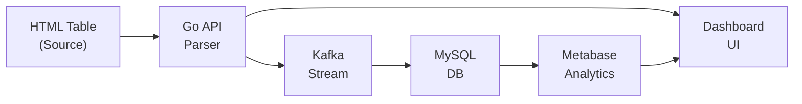

# Fintech Data Ingestion Platform

A production-ready data ingestion system that fetches HTML tables from URLs, automatically infers schema, streams data through Kafka, and persists to MySQL with real-time monitoring.

## 🏗️ Architecture




## ✨ Features

### Core Functionality
- ✅ **URL Fetching**: HTTP requests with timeout and error handling
- ✅ **HTML Parsing**: Extracts tables from any HTML page
- ✅ **Smart Schema Inference**: Automatically detects INT, FLOAT, DATE, DATETIME, TEXT
- ✅ **Data Cleaning**: Removes currency symbols, commas, formatting
- ✅ **Kafka Streaming**: Decoupled producer-consumer architecture
- ✅ **MySQL Persistence**: Dynamic table creation with inferred schema
- ✅ **Real-time Progress**: Live ingestion tracking and logging
- ✅ **Data Explorer**: Built-in UI to browse ingested tables

### Advanced Features
- 🎯 **DataTables Support**: Handles complex JavaScript-enhanced tables
- 🔄 **Multiple Modes**: Create new table or append to existing
- 🚫 **Deduplication**: INSERT IGNORE for idempotent writes
- 📊 **Metabase Integration**: SQL analytics and visualization
- 🎨 **Web Dashboard**: Preview, configure, and monitor ingestion
- 📝 **Column Normalization**: Safe SQL-compliant column names

## 🚀 Quick Start

### Prerequisites
- Docker & Docker Compose
- Go 1.21+ (for local development)

### Run the Platform

1. **Clone and setup**
```bash
git clone <your-repo>
cd fintech_pipeline/docker
```

2. **Start services**
```bash
docker-compose up -d
```

3. **Verify services**
```bash
docker-compose ps
```

Expected output:
```
mysql       Running   0.0.0.0:3306->3306/tcp
kafka       Running   0.0.0.0:9092->9092/tcp
app         Running   0.0.0.0:8081->8081/tcp
metabase    Running   0.0.0.0:3000->3000/tcp
```

### Access Points

| Service | URL | Purpose |
|---------|-----|---------|
| **Dashboard** | http://localhost:8081 | Main ingestion UI |
| **Metabase** | http://localhost:3000 | SQL analytics |
| **MySQL** | localhost:3306 | Direct DB access |
| **Kafka** | localhost:9092 | Message broker |

## 📖 Usage Guide

### 1. Ingest Data via Dashboard

1. Open http://localhost:8081
2. Enter a URL with an HTML table (e.g., Wikipedia tables)
3. Click **Preview** to see schema inference
4. Configure:
   - Table name
   - Mode (create/append)
   - Deduplication
5. Click **Ingest**
6. Monitor real-time progress

### 2. Query Data in Metabase

1. Open http://localhost:3000
2. Setup admin account (first time)
3. Add MySQL connection:
   - **Host**: `mysql`
   - **Port**: `3306`
   - **Database**: `fintech`
   - **Username**: `fintech`
   - **Password**: `fintechpass`
   - **JDBC Options**: `allowPublicKeyRetrieval=true&useSSL=false`
4. Browse and query your ingested tables

### 3. Example URLs to Try

**Wikipedia Tables** (Clean, well-structured):
```
https://en.wikipedia.org/wiki/List_of_S%26P_500_companies
https://en.wikipedia.org/wiki/List_of_largest_companies_by_revenue
```

**Government Data** (Various formats):
```
https://data.gov (various datasets)
```

## 🔧 Configuration

Environment variables (`.env` file):

```env
# MySQL Configuration
MYSQL_ROOT_PASSWORD=rootpass
MYSQL_DATABASE=fintech
MYSQL_USER=fintech
MYSQL_PASSWORD=fintechpass

# Application Database Connection
DB_HOST=mysql
DB_PORT=3306
DB_USER=fintech
DB_PASSWORD=fintechpass
DB_NAME=fintech

# Kafka Configuration
KAFKA_BROKER=kafka:9092

# Application Port
APP_PORT=8081
```

## 🏛️ System Design

### Data Flow

1. **Ingestion Request**
   - User provides URL via Dashboard
   - Go API fetches HTML document
   - Parser extracts table structure

2. **Schema Inference**
   - Analyze each column's values
   - Apply 80% threshold for type detection
   - Clean data (remove $, commas, etc.)
   - Generate normalized column names

3. **Kafka Streaming**
   - Producer: Publishes ingestion job to `table_rows` topic
   - Consumer: Reads from topic, writes to MySQL
   - Decoupled architecture for scalability

4. **Database Persistence**
   - Dynamic table creation based on inferred schema
   - Batch progress updates every 50 rows
   - INSERT IGNORE for deduplication
   - Real-time status tracking

### Type Inference Algorithm

```go
For each column:
  1. Clean values (remove $, commas, brackets)
  2. Test each value against type patterns
  3. Count matches for INT, FLOAT, DATE, DATETIME
  4. If 80%+ match → assign that type
  5. Default → TEXT
```

Supported types:
- `INT`: Whole numbers
- `FLOAT`: Decimal numbers
- `DATE`: Various date formats (YYYY-MM-DD, MM/DD/YYYY, etc.)
- `DATETIME`: Timestamps with time component
- `TEXT`: Everything else

### Column Normalization

Ensures SQL-safe column names:
```
"Salary ($)" → "salary"
"Start Date" → "start_date"
"Employee #" → "employee"
"Column" (duplicate) → "column_2"
```

## 📊 Database Schema

### Metadata Tables

**`ingestion_jobs`**
```sql
id VARCHAR(64) PRIMARY KEY
table_name TEXT
total_rows INT
inserted_rows INT
status TEXT
created_at TIMESTAMP
```

**`ingestion_logs`**
```sql
id INT AUTO_INCREMENT PRIMARY KEY
job_id VARCHAR(64)
message TEXT
created_at TIMESTAMP
```

### Dynamic Tables
Created automatically based on inferred schema from source data.

## 🛡️ Production Considerations

### Error Handling
- ✅ Network timeouts (10s default)
- ✅ Malformed HTML gracefully handled
- ✅ Missing tables detected
- ✅ Type inference fallbacks
- ✅ Database connection retries (20 attempts)
- ✅ Kafka message delivery confirmation

### Performance
- 🚀 Batch status updates (every 50 rows)
- 🚀 INSERT IGNORE for deduplication
- 🚀 Async Kafka consumer
- 🚀 Connection pooling

### Logging
- 📝 Structured console output
- 📝 Ingestion progress tracking
- 📝 Error reporting with context
- 📝 Real-time job status

### Scalability
- 📈 Kafka enables horizontal scaling
- 📈 Stateless API servers
- 📈 Database connection pooling
- 📈 Async processing model

## 🧪 Testing

### Test Data Sources

1. **Sample HTML File** (included)
```bash
# Serve locally
cp sample_table.html web/
# Access: http://localhost:8081/sample_table.html
```

2. **Wikipedia Tables**
Excellent for testing - clean structure, varied data types

3. **Custom HTML**
Create your own test tables

### Verification

```bash
# Check ingested data
docker exec -it <mysql-container> mysql -u fintech -pfintechpass fintech

mysql> SHOW TABLES;
mysql> DESCRIBE your_table_name;
mysql> SELECT * FROM your_table_name LIMIT 10;
```

## 🐛 Troubleshooting

### Metabase Connection Issues

**Error**: "RSA public key is not available"

**Fix**: Add JDBC options in Metabase:
```
allowPublicKeyRetrieval=true&useSSL=false
```

### Kafka Not Starting

Wait 30 seconds after `docker-compose up` - Kafka needs time to initialize.

### MySQL Connection Refused

```bash
# Check if MySQL is ready
docker logs <mysql-container> | grep "ready for connections"
```

## 📁 Project Structure

```
fintech_pipeline/
├── docker/
│   ├── docker-compose.yml      # Service orchestration
│   └── .env                    # Configuration
├── main.go                     # Core Go application
├── web/
│   ├── index.html             # Dashboard UI
│   └── app.js                 # Frontend logic
└── README.md                  # This file
```

## 📝 API Reference

### POST /preview
Preview table structure before ingestion
```json
Request: {"url": "https://example.com/table"}
Response: {
  "columns": ["name", "age", "salary"],
  "types": {"name": "TEXT", "age": "INT", "salary": "FLOAT"},
  "rows": [["John", "30", "50000"], ...]
}
```

### POST /ingest
Start data ingestion job
```json
Request: {
  "url": "https://example.com/table",
  "table": "employees",
  "mode": "create",
  "dedup": true
}
Response: "<job-id>"
```

### GET /job_status?id=<job-id>
Check ingestion progress
```json
Response: {
  "total": 100,
  "inserted": 75,
  "status": "running"
}
```

### GET /tables
List all ingested tables
```json
Response: ["employees", "sales", "products"]
```

### GET /table?name=<table-name>
View table data
```json
Response: [
  {"name": "John", "age": 30, "salary": 50000},
  ...
]
```

## 👨‍💻 Technical Stack

- **Backend**: Go 1.21+
- **Frontend**: Vanilla JavaScript, HTML5, CSS3
- **Message Broker**: Apache Kafka
- **Database**: MySQL 8
- **Analytics**: Metabase
- **Infrastructure**: Docker, Docker Compose

## 📄 License

MIT License - feel free to use for your projects!

## 🙏 Acknowledgments

Built as a demonstration of:
- Microservices architecture
- Event-driven design
- Data pipeline engineering
- Production-ready Go development
- Real-time data processing

---

**Made with ❤️ for production-grade data ingestion**
